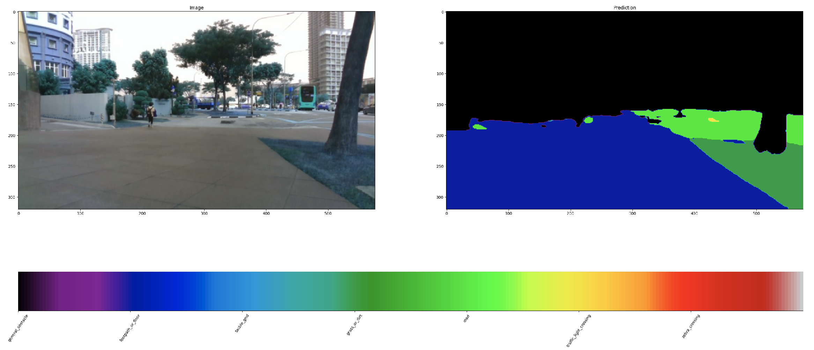

## About 

This post will cover the experimentation for deploying the pre-trained neural network models for on-board computers, such as NUC11. I have experimented with the following framework/toolbox 

- [onnx](https://onnx.ai/)
- [MMDeploy](https://mmdeploy.readthedocs.io/en/latest/)
- [NVIDIA TensorRT](https://developer.nvidia.com/tensorrt)
- [TVM](https://tvm.apache.org/)

## ONNX 

Previously, our segmentation model was trained using tensorflow, based on [DeepLabv3](https://github.com/tensorflow/models/tree/master/research/deeplab). For deployment, we used `uff` format before. However, there are unsupported operations to convert uff to TensorRT, and need to compile TensorRT from source. 

To circumvent this issue with uff format, we can also convert the models trained from tensorflow/pytorch to [onnx](https://onnx.ai/) format, which defines a set of common operations in a common file format.  The saved model in frozen graph format can be converted to onnx via 
```bash 
python -m tf2onnx.convert --graphdef frozen_inference_graph_segmentation.pb --output frozen_inference_graph_segmentation.onnx \
    --opset 11 \
    --inputs model/image:0[1,320,576,3] \
    --outputs model/semantic_segmentation/semantic_segmentation/ArgMax:0  
```

To do inference using onnx, use the script below 
```python
import tensorrt as trt
import numpy as np
import os

import pycuda.driver as cuda
import pycuda.autoinit
import cv2
import torch
from torchvision import transforms
import numpy as np
import onnx
import onnxruntime
from matplotlib import pyplot as plt

def normalise_input(im_float32: np.ndarray) -> np.ndarray:

    mean = np.mean(im_float32, keepdims=True)

    rsd = 1.0 / np.sqrt(np.mean(np.square(im_float32), keepdims=True) - np.square(mean))

    rsd = np.minimum(rsd, 3 * np.prod(im_float32.shape))

    im_float32 = (im_float32 - mean) * rsd

    im_float32 = np.clip(0.2 * im_float32 + 0.5, 0.0, 1.0)
    im_float32 = im_float32.astype(np.float32)

    return im_float32


if __name__ == "__main__":

    batch_size = 1
    filename = "frozen_inference_graph_segmentation.onnx"
    onnx_path = os.path.join("/home/sean/workspace/trt_models", filename)

    onnx_model = onnx.load(onnx_path)
    onnx.checker.check_model(onnx_model)
    ort_session = onnxruntime.InferenceSession(onnx_path)

    img_path = os.path.join("/home/sean/workspace/tensorrt_ws/data", "frame_00207_1566804935.650853634.png")
    input_img = cv2.imread(img_path) 
    input_img = cv2.resize(input_img, (576, 320), interpolation = cv2.INTER_AREA)
    # cv2.imshow("image", input_img)
    # cv2.waitKey(0)
    data = normalise_input(input_img.astype(np.float32) / 255.0)
    data = np.expand_dims(data, axis=0)

    ort_inputs = {ort_session.get_inputs()[0].name: data}
    ort_outs = ort_session.run(None, ort_inputs)
    preds = ort_outs[0]
    onnx_image = torch.from_numpy(preds)
    onnx_image = onnx_image.squeeze(0)
    onnx_image = onnx_image.detach().cpu().numpy()
    onnx_image = onnx_image.astype(np.uint8)

    num_classes = 7

    fig, axs = plt.subplots(1, 2, figsize=(16, 16))

    images = []

    axs[0].set_title("Image")
    axs[1].set_title("Prediction")

    images.append(axs[0].imshow(input_img.astype(int)))
    images.append(axs[1].imshow(onnx_image, cmap=plt.get_cmap('nipy_spectral'), vmin=0, vmax=num_classes))

    seg_classes = [
          "general_obstacle",
          "footpath_or_floor",
          "tactile_grid",
          "grass_or_dirt",
          "road",
          "traffic_light_crossing",
          "zebra_crossing",
    ]

    cbar = fig.colorbar(images[1], ax=axs, orientation='horizontal', ticks=[x for x in range(num_classes)], fraction=.1)
    cbar.ax.set_xticklabels(list(seg_classes), rotation=55)

    plt.show()
    plt.pause(0)
```

The converted onnx model works fine in python, as can be seen below 


## TensorRT

The onnx model can be converted to TensorRT following [this guide](https://docs.nvidia.com/deeplearning/tensorrt/quick-start-guide/index.html#convert-model), or via the script below 
```python
import os
import time
import torch
import torchvision
import numpy as np
import tensorrt as trt

os.environ["CUDA_VISIBLE_DEVICES"] = '0'

TRT_LOGGER = trt.Logger(trt.Logger.VERBOSE)


def build_engine(onnx_file_path, engine_file_path, max_batch_size=1, save_engine=False):
    """
    Args:
      max_batch_size: 
      save_engine:    
    return:
      ICudaEngine
    """
    EXPLICIT_BATCH = 1 << (int)(trt.NetworkDefinitionCreationFlag.EXPLICIT_BATCH)
    with trt.Builder(TRT_LOGGER) as builder, builder.create_network(EXPLICIT_BATCH) as network, builder.create_builder_config() as config, trt.OnnxParser(network, TRT_LOGGER) as parser: 
        config = builder.create_builder_config()
        config.max_workspace_size = 2 << 30
        builder.max_batch_size = max_batch_size        

        if not os.path.exists(onnx_file_path):
            quit("ONNX file {} not found!".format(onnx_file_path))
        print('loading onnx file from path {} ...'.format(onnx_file_path))
        with open(onnx_file_path, 'rb') as model:
            print("Begining onnx file parsing")
            if not parser.parse(model.read()):         
                print('ERROR: Failed to parse the ONNX file.')
                for error in range(parser.num_errors):
                    print(parser.get_error(error))     
                return None

        last_layer = network.get_layer(network.num_layers - 1)
        # Check if last layer recognizes it's output
        if not last_layer.get_output(0):
            # If not, then mark the output using TensorRT API
            network.mark_output(last_layer.get_output(0))
        print("Completed parsing of onnx file")

        print("Building an engine from file{}' this may take a while...".format(onnx_file_path))
        engine=builder.build_engine(network, config)  
        print("Completed creating Engine")
        if save_engine:
            with open(engine_file_path, 'wb') as f:
                f.write(engine.serialize())
        return engine


if __name__ == '__main__':
    root_dir = "/home/sean/workspace/trt_models/"

    onnx_file_path = root_dir + "frozen_inference_graph_segmentation.onnx"
    # onnx_file_path = root_dir + "frozen_inference_graph_detection.onnx"

    trt_engine_path = root_dir + "frozen_inference_graph_segmentation.trt8.bin"
    # trt_engine_path = root_dir + "frozen_inference_graph_detection.trt8.bin"

    max_batch_size = 1
    engine = build_engine(onnx_file_path, trt_engine_path, max_batch_size, save_engine=True)
```

Then we can do inference using 
```python 
import tensorrt as trt
import numpy as np
import os

import pycuda.driver as cuda
import pycuda.autoinit
import cv2
import torch
from torchvision import transforms
import numpy as np


def normalise_input(im_float32: np.ndarray) -> np.ndarray:

    mean = np.mean(im_float32, keepdims=True)

    rsd = 1.0 / np.sqrt(np.mean(np.square(im_float32), keepdims=True) - np.square(mean))

    rsd = np.minimum(rsd, 3 * np.prod(im_float32.shape))

    im_float32 = (im_float32 - mean) * rsd

    im_float32 = np.clip(0.2 * im_float32 + 0.5, 0.0, 1.0)

    return im_float32


class HostDeviceMem(object):
    def __init__(self, host_mem, device_mem):
        self.host = host_mem
        self.device = device_mem

    def __str__(self):
        return "Host:\n" + str(self.host) + "\nDevice:\n" + str(self.device)

    def __repr__(self):
        return self.__str__()

class TrtModel:
    
    def __init__(self,engine_path,max_batch_size=1,dtype=np.float32):
        
        self.engine_path = engine_path
        self.dtype = dtype
        self.logger = trt.Logger(trt.Logger.WARNING)
        self.runtime = trt.Runtime(self.logger)
        self.engine = self.load_engine(self.runtime, self.engine_path)

        self.max_batch_size = max_batch_size
        self.inputs, self.outputs, self.bindings, self.stream = self.allocate_buffers()
        self.context = self.engine.create_execution_context()

                
    @staticmethod
    def load_engine(trt_runtime, engine_path):
        trt.init_libnvinfer_plugins(None, "")             
        with open(engine_path, 'rb') as f:
            engine_data = f.read()
        engine = trt_runtime.deserialize_cuda_engine(engine_data)
        return engine
    
    def allocate_buffers(self):
        
        inputs = []
        outputs = []
        bindings = []
        stream = cuda.Stream()
        
        for binding in self.engine:
            size = trt.volume(self.engine.get_binding_shape(binding)) * self.max_batch_size
            host_mem = cuda.pagelocked_empty(size, self.dtype)
            device_mem = cuda.mem_alloc(host_mem.nbytes)
            
            bindings.append(int(device_mem))

            if self.engine.binding_is_input(binding):
                inputs.append(HostDeviceMem(host_mem, device_mem))
            else:
                outputs.append(HostDeviceMem(host_mem, device_mem))
        
        return inputs, outputs, bindings, stream
       
            
    def __call__(self,x:np.ndarray,batch_size=2):
        
        x = x.astype(self.dtype)
        
        np.copyto(self.inputs[0].host,x.ravel())
        
        for inp in self.inputs:
            cuda.memcpy_htod_async(inp.device, inp.host, self.stream)
        
        self.context.execute_async(batch_size=batch_size, bindings=self.bindings, stream_handle=self.stream.handle)
        for out in self.outputs:
            cuda.memcpy_dtoh_async(out.host, out.device, self.stream) 
            
        
        self.stream.synchronize()
        return [out.host.reshape(batch_size,-1) for out in self.outputs
        
if __name__ == "__main__":
 
    batch_size = 1
    filename = "frozen_inference_graph_segmentation.trt"
    # filename = "frozen_inference_graph_detection.trt8.bin"
    trt_engine_path = os.path.join("/home/sean/workspace/trt_models", filename)
    model = TrtModel(trt_engine_path)
    shape = model.engine.get_binding_shape(0)

    img_path = os.path.join("/home/sean/workspace/tensorrt_ws/data", "frame_00207_1566804935.650853634.png")
    input_img = cv2.imread(img_path) 
    input_img = cv2.resize(input_img, (576, 320), interpolation = cv2.INTER_AREA)
    # cv2.imshow("image", input_img)
    # cv2.waitKey(0)
    data = normalise_input(input_img.astype(np.float32) / 255.0)
    data = np.expand_dims(data, axis=0)
    # data = np.random.randint(0,255,(batch_size,*shape[1:]))/255

    # result = model(data, batch_size)
    # print(result.shape)

    engine = model.engine 
    # get sizes of input and output and allocate memory required for input data and for output data
    for binding in engine:
        if engine.binding_is_input(binding):  # we expect only one input
            input_shape = engine.get_binding_shape(binding)
            input_size = trt.volume(input_shape) * engine.max_batch_size * np.dtype(np.float32).itemsize  # in bytes
            device_input = cuda.mem_alloc(input_size)
        else:  # and one output
            output_shape = engine.get_binding_shape(binding)
            # create page-locked memory buffers (i.e. won't be swapped to disk)
            host_output = cuda.pagelocked_empty(trt.volume(output_shape) * engine.max_batch_size, dtype=np.float32)
            device_output = cuda.mem_alloc(host_output.nbytes)

    host_input = np.array(data, dtype=np.float32, order='C')
    cuda.memcpy_htod(device_input, host_input)

    # run inference
    context = engine.create_execution_context()
    context.execute(bindings=[int(device_input), int(device_output)])
    cuda.memcpy_dtoh(host_output, device_output)

    # postprocess results
    output_data = torch.Tensor(host_output).reshape(engine.max_batch_size, output_shape[0])
    print(output_data)
```

However, the output for the segmentation mask contains all zero, maybe due to precision loss during conversion, or unsupported layer, etc.

TODO:
- [ ] need to debug the output layer by layer and check what's the cause for zero-value output

## MMDeploy 

[MMDetection](https://github.com/open-mmlab/mmdetection) is a toolbox based on pytorch that supports multiple object detection frameworks, such as Faster RCNN, Mask RCNN, RetinaNet, etc. 
MMDeploy facilitates the deployment by supported multiple backends. Using MMDeploy, the models trained with MMDetection can be exported to onnx, TensorRT, etc. 

I also tried to port the models to onnx based on [this guide](https://github.com/open-mmlab/mmdetection/blob/master/docs/en/tutorials/pytorch2onnx.md) 

## TVM